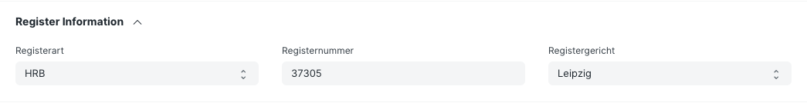
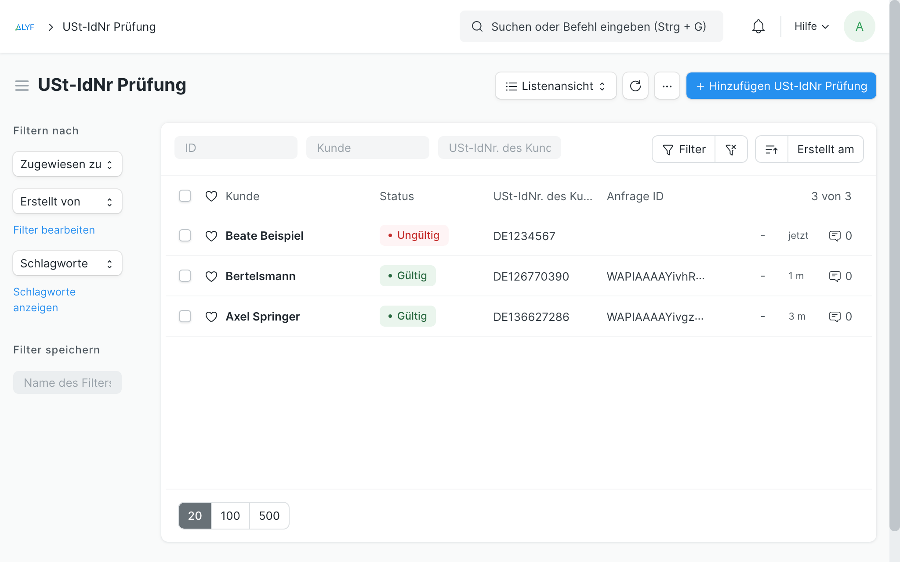

## ERPNext Germany

App to hold regional code for Germany, built on top of ERPNext.

### Features

- German accounting reports

    - _Summen- und Saldenliste_

- Section for Register Information (Registerart, -gericht und nummer) in **Company**, **Customer** and **Supplier**

    

- Validation of EU VAT IDs

    Automatically checks the validity of EU VAT IDs of all your customers every three months, or manually whenever you want. Check out the [intro on Youtube](https://youtu.be/hsFMn2Y85zA) (german).

    

- Allow deletion of the most recent sales transaction only

    This ensures consecutive numbering of transactions. Applies to **Quotation**, **Sales Order**, **Sales Invoice**.

- Custom fields in **Employee** (tax information, etc.)
- List of religios denominations ("Konfessionen")
- List of German health insurance providers

    Requires [HRMS](https://github.com/frappe/hrms) to be installed first.

- Create **Business Letters** from a template and print or email them to your customers or suppliers
- Record **Business Trips** and pay out allowances to your employees (dt. Reisekostenabrechnung)

## Installation

### On Frappe Cloud

1. Go to https://frappecloud.com/dashboard/#/sites and click the "New Site" button.
2. In Step 2 ("Select apps to install"), select "ERPNext" and "ERPNext Germany".
3. Complete the new site wizard.

### Local

Using bench, [install ERPNext](https://github.com/frappe/bench#installation) as mentioned here.

Once ERPNext is installed, add the ERPNext Germany app to your bench by running

```bash
bench get-app https://github.com/alyf-de/erpnext_germany.git
```

After that, you can install the app on required site (let's say demo.com ) by running

```bash
bench --site demo.com install-app erpnext_germany
```

## Business Trip

Before an employee can create a **Business Trip**, you should configure the available regions and their travel allowances in the **Business Trip Region** list.

When a **Business Trip** is submitted, it creates a draft **Expense Claim** for the employee's travel allowances. The **Expense Claim** can be approved and submitted as usual.

The receipts for transport and accommodation can be attached, but are not processed automatically. You can check them, create a **Purchase Invoice** and pay the respective amount to the employee.

You can use our [Banking app](https://github.com/alyf-de/banking) to reconcile the **Expense Claims** and **Purchase Invoices** with the respective **Bank Transactions**.

### License

GNU GPL V3. See the `LICENSE` file for more information.
