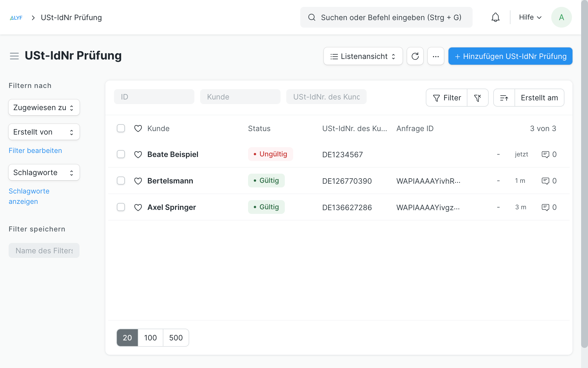

## ERPNext Germany

App to hold regional code for Germany, built on top of ERPNext.

### Features

- German accounting reports

    - _Summen- und Saldenliste_
    - _Zusammenfassende Meldung_

- Section for Register Information (Registerart, -gericht und nummer) in **Company**, **Customer** and **Supplier**

    

- Validation of EU VAT IDs

    Automatically checks the validity of EU VAT IDs of all your customers every three months, or manually whenever you want. Check out the [intro on Youtube](https://youtu.be/hsFMn2Y85zA) (german).

    

- Allow deletion of the most recent sales transaction only

    This ensures consecutive numbering of transactions. Applies to **Quotation**, **Sales Order**, **Sales Invoice**.

- Custom fields in **Employee** (tax information, etc.)
- List of religios denominations ("Konfessionen")
- List of German health insurance providers

    Requires [HRMS](https://github.com/frappe/hrms) to be installed first.

- Create **Business Letters** from a template and print or email them to your customers or suppliers

## Installation

### On Frappe Cloud

1. Go to https://frappecloud.com/dashboard/#/sites and click the "New Site" button.
2. In Step 2 ("Select apps to install"), select "ERPNext" and "ERPNext Germany".
3. Complete the new site wizard.

### Local

Using bench, [install ERPNext](https://github.com/frappe/bench#installation) as mentioned here.

Once ERPNext is installed, add the ERPNext Germany app to your bench by running

```bash
bench get-app https://github.com/alyf-de/erpnext_germany.git
```

After that, you can install the app on required site (let's say demo.com ) by running

```bash
bench --site demo.com install-app erpnext_germany
```

<<<<<<< HEAD
=======
## Business Trip

Before an employee can create a **Business Trip (Dienstreise)**, you should configure the available regions and their travel allowances in the **Business Trip Region** list. A basic list based on the German tax law is imported on installation, but not further updated later. In the **Business Trip Settings (Dienstreise-Einstellungen)** you can set the value for the mileage allowance and select **Expense Claim Type** for mileage allowance and **Additional meal expenses**. Both Expense Claim Type are preset to **Additional meal expenses**. If you have HRMS installed, it allows you to book expenses as Expense Claims.

When a **Business Trip** is submitted, it creates a draft **Expense Claim** for the employee's travel allowances including the Additional meal expenses as well as mileage allowance for "Car (private)". One business trip will create on **Expense Claim** which can be approved and submitted as usual.

Mileage allowance is calculated based on the distance entered in the details of the journey when "Car (private)" is selected.

The Additional meal expenses depend on the selected region. Select the "From" and "To" dates of the trip and with the click on "Add Row" all days of the trip a pre-created.

The receipts for transport and accommodation can be attached, but are not processed automatically. You can check them, create a **Purchase Invoice** and pay the respective amount to the employee.

You can use our [Banking app](https://github.com/alyf-de/banking) to reconcile the **Expense Claims** and **Purchase Invoices** with the respective **Bank Transactions**.

## Zusammenfassende Meldung

Currently, this report lists all invoices as other service ("S"). If you do triangular transactions ("D") or intra-Community supplies ("L"), you need to manually adjust this column in the CSV file. Automatically determining the service type is planned for a future version.

## Quick Start Demo

The fastest way to get a running demo site on your local desktop.

Prerequisites: [Docker](https://www.docker.com/) and [git](https://git-scm.com/) installed on your machine.

```bash
git clone https://github.com/alyf-de/erpnext_germany.git
cd erpnext_germany/docker
cp .env.example .env
docker compose up -d
```

The first setup will take a while. Then you can access the demo site at http://localhost:8000.
Log in with the Username `Administrator` and the default password `admin`.

Read more about the setup in the [docker/README.md](docker/README.md) file.

>>>>>>> 8e719b5 (feat: report "Zusammenfassende Meldung" (#104))
### License

GNU GPL V3. See the `LICENSE` file for more information.
